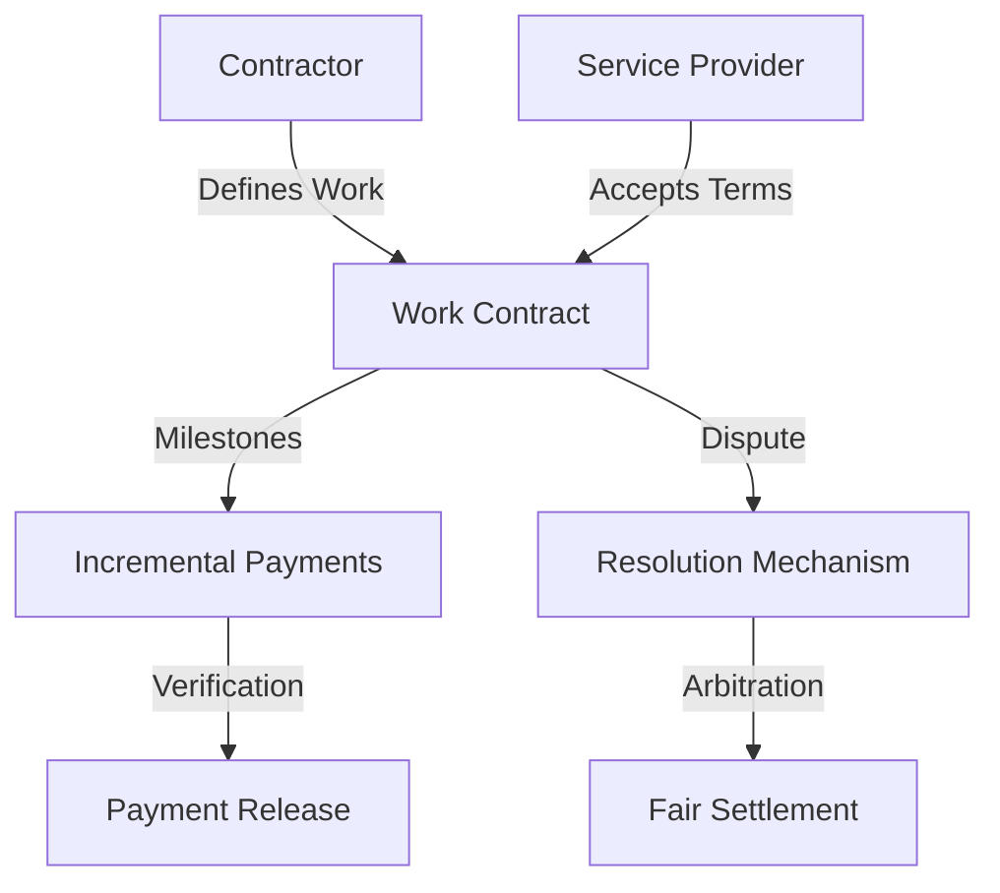

# Recurring Hash Instrument

A decentralized contract marketplace built on Stacks that provides secure, transparent tracking of work assignments and payments. The Hash Market eliminates traditional intermediaries by leveraging blockchain technology to manage gig economy interactions.

## Overview

Hash Market enables:
- Secure and transparent work assignment tracking
- Milestone-based payment mechanisms
- Decentralized dispute resolution
- Low-overhead contract management
- Reputation and performance tracking

## Architecture



The system uses comprehensive data tracking for:
- Work contract details and status
- Milestone progression
- Payment tracking
- Dispute management
- Performance reputation

## Contract Documentation

### Main Contract: hash-market

Core functionalities:

1. **Contract Management**
   - Define work contracts
   - Set milestone requirements
   - Track contract progression
   - Verify completion stages

2. **Payment Mechanisms**
   - Secure fund escrow
   - Milestone-based releases
   - Performance-linked compensation
   - Transparent fee structure

3. **Dispute Resolution**
   - Impartial arbitration process
   - Evidence-based evaluation
   - Fair settlement procedures

## Getting Started

### Prerequisites
- Clarinet installation
- Stacks wallet
- STX tokens for transactions

### Basic Usage

**1. Posting a Job**
```clarity
(contract-call? .flexhive-marketplace post-job 
    "Job Title" 
    "Job Description" 
    u1000 ;; amount in STX
    u100   ;; deadline block height
)
```

**2. Submitting a Proposal**
```clarity
(contract-call? .flexhive-marketplace submit-proposal 
    u1 ;; job-id
    "Proposal details" 
    u900 ;; proposed amount
    u90  ;; proposed deadline
)
```

**3. Accepting a Proposal**
```clarity
(contract-call? .flexhive-marketplace accept-proposal 
    u1 ;; job-id
    'SP2J6ZY48GV1EZ5V2V5RB9MP66SW86PYKKNRV9EJ7 ;; freelancer address
)
```

## Function Reference

### Client Functions
- `post-job`: Create new job listing
- `accept-proposal`: Accept freelancer's proposal
- `add-milestone`: Create payment milestone
- `release-milestone-payment`: Release milestone payment
- `approve-job-completion`: Approve and finalize job
- `add-bonus-payment`: Add bonus compensation

### Freelancer Functions
- `submit-proposal`: Submit job proposal
- `submit-job-completion`: Mark job as complete

### Dispute Functions
- `initiate-dispute`: Start dispute process
- `submit-dispute-evidence`: Submit evidence
- `resolve-dispute`: Resolve dispute (arbiter only)

## Development

### Testing
Run tests using Clarinet:
```bash
clarinet test
```

### Security Considerations

1. **Fund Safety**
   - All funds are held in escrow
   - Milestone-based releases
   - Dispute resolution mechanism

2. **Access Control**
   - Role-based function access
   - Validation of principals
   - Status-based operation checks

3. **Edge Cases**
   - Deadline enforcement
   - Payment validation
   - Status transitions

### Important Limitations
- Dispute resolution requires approved arbiters
- Platform fee is fixed at 2.5%
- Job modifications after posting are limited
- All amounts are in STX tokens only